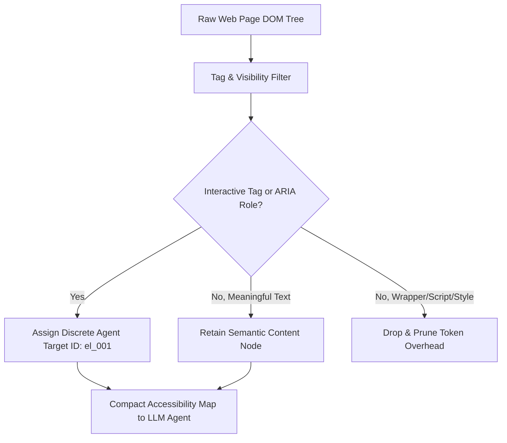

# GenPark AI Agent Skill - DOM Semantic Accessibility Tree Pruner

Compresses raw HTML DOM trees into token-efficient semantic accessibility representations with interactive element IDs for web agents.

Verified by [GenPark AI](https://genpark.ai) and compatible with [Model Context Protocol (MCP)](https://genpark.ai/mcp).

## Architecture Diagram

## Features
- **Token Efficiency**: Reduces DOM footprint by up to 85% for multimodal/text agents.
- **Discrete Target Mapping**: Equips agents with deterministic target IDs (`el_001`, `el_002`) for clicks and keystrokes.
- **Zero External Dependencies**: Pure Python 3.9+ standard library.
